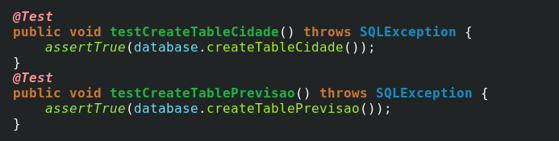
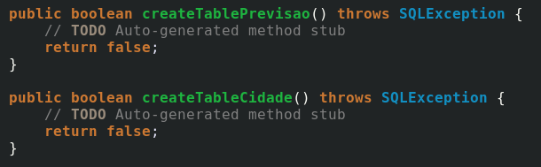
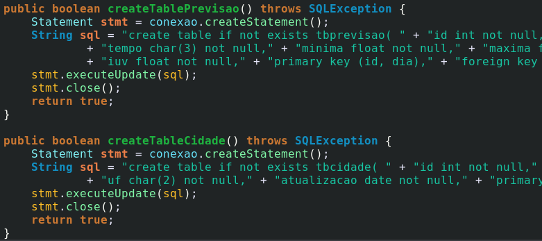

# Weather
## Atividade 4 Teste de Software - Prática de TDD

Projeto final da aula de teste de software, programado com a metodologia TDD na qual, o teste vem antes da implementação do código.
Esse programa pega o clima dos próximos 7 dias da cidade selecionada.

### Classe Database

#### Métodos createTable

#### Código Gerado

#### Métodos implementados
