# Weather
## Atividade 4 Teste de Software - Prática de TDD

Projeto final da aula de teste de software, programado com a metodologia TDD na qual, o teste vem antes da implementação do código.
Esse programa pega o clima dos próximos 7 dias da cidade selecionada.

### Classe Database

#### Métodos createTable (DatabaseTest)

>>##### Código Gerado (Database)
>>

>>##### Métodos implementados (Database)
>>

#### Métodos insert (DatabaseTest)
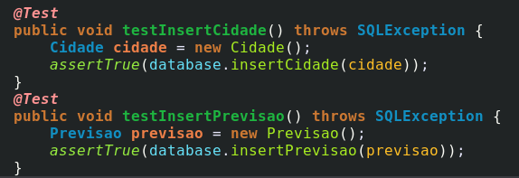

>>#### Código Gerado (Database)
>>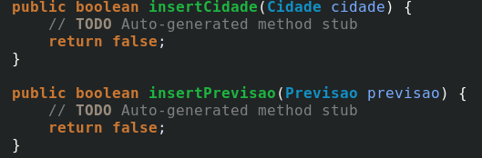

>>#### Métodos implementados (Database)
>>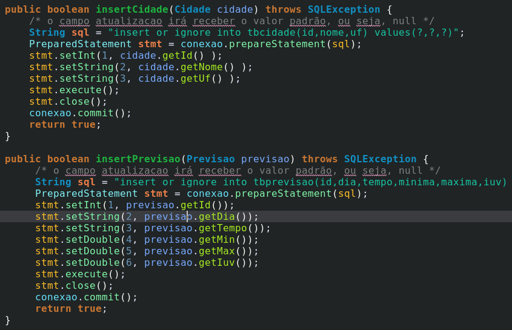

#### Métodos select (DatabaseTest)
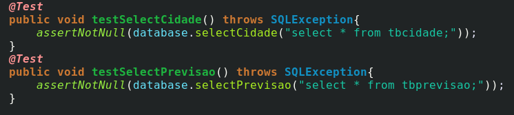

>>#### Código Gerado (Database)
>>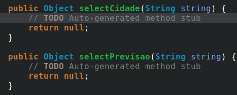

>>#### Métodos implementados (Database)
>>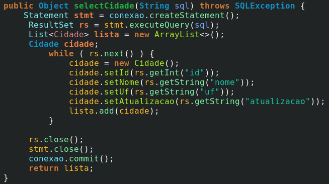
>>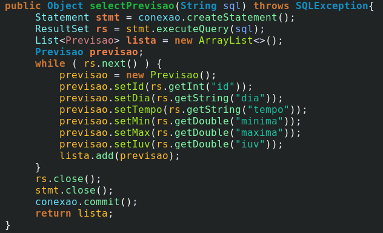

### Classe Api

#### Métodos getXML (ApiTest)
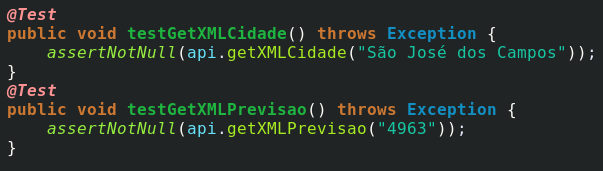

>>#### Código Gerado (Api)
>>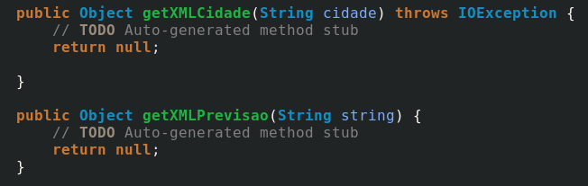

>>#### Métodos implementados (Api)
>>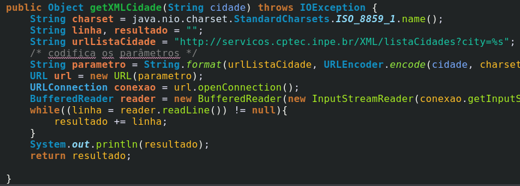
>>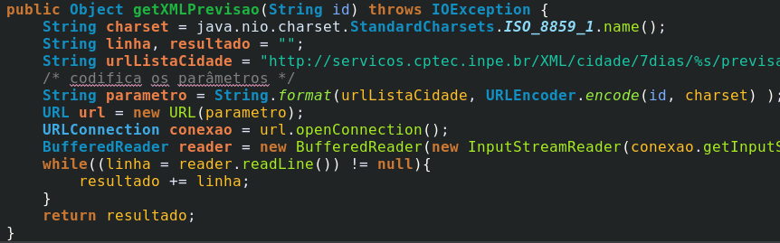

#### Métodos xmlToObject (ApiTest)

>>#### Código Gerado (Api)
>>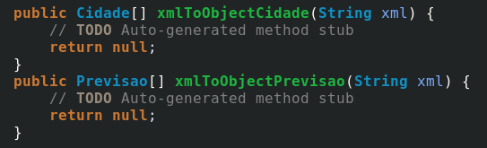

>>#### Métodos implementados (Api)
>>

### Classe Cidade

#### setUp do teste (CidadeTest)

#### getters e setters (CidadeTest)
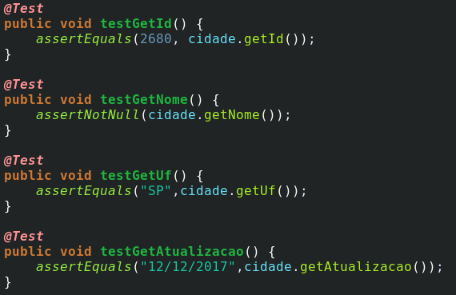

>>#### Métodos implementados (Cidade)
>>

### Classe Cidades

#### setUp do teste e método getCidade (CidadesTest)
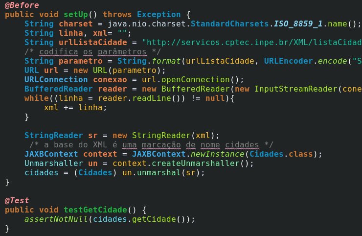

>>#### Métodos implementados (Cidades)
>>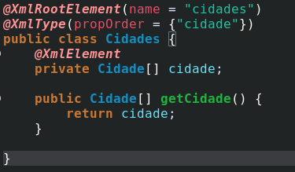

### Classe Previsao

#### setUp do teste (PrevisaoTest)
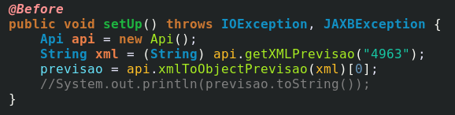

#### getters e setters (PrevisaoTest)

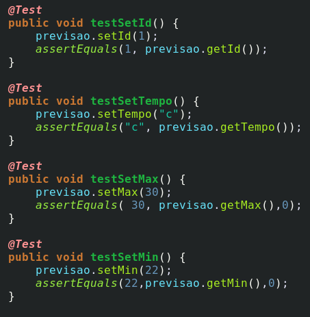

>>#### Métodos implementados (Previsao)
>>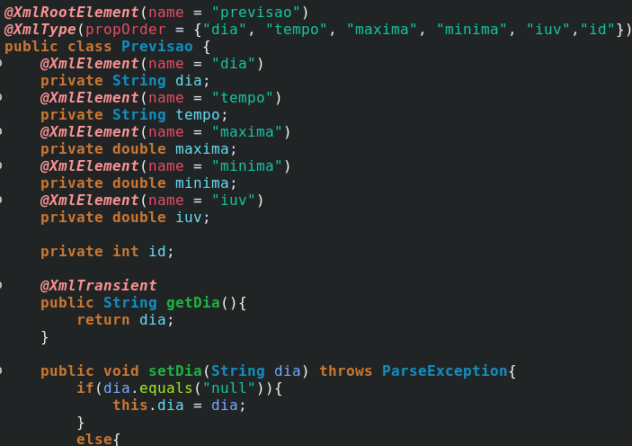

### Classe Previsões

#### setUp do teste e método getPrevisao (PrevisoesTest)
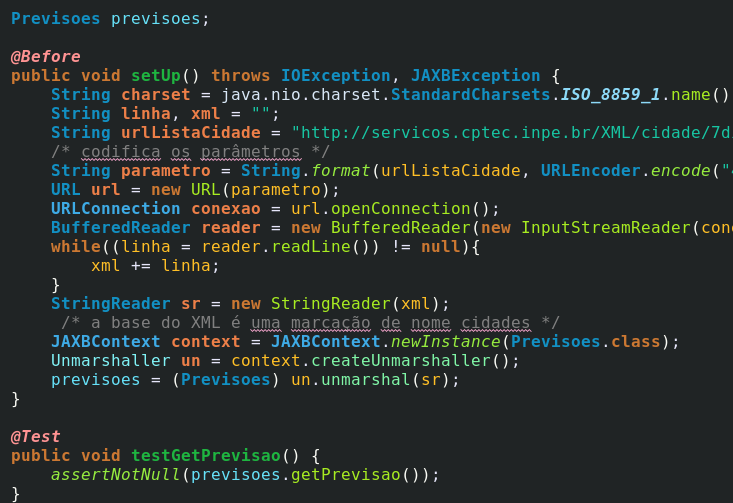

>>#### Métodos implementados (Previsoes)
>>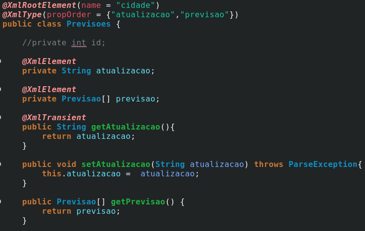
